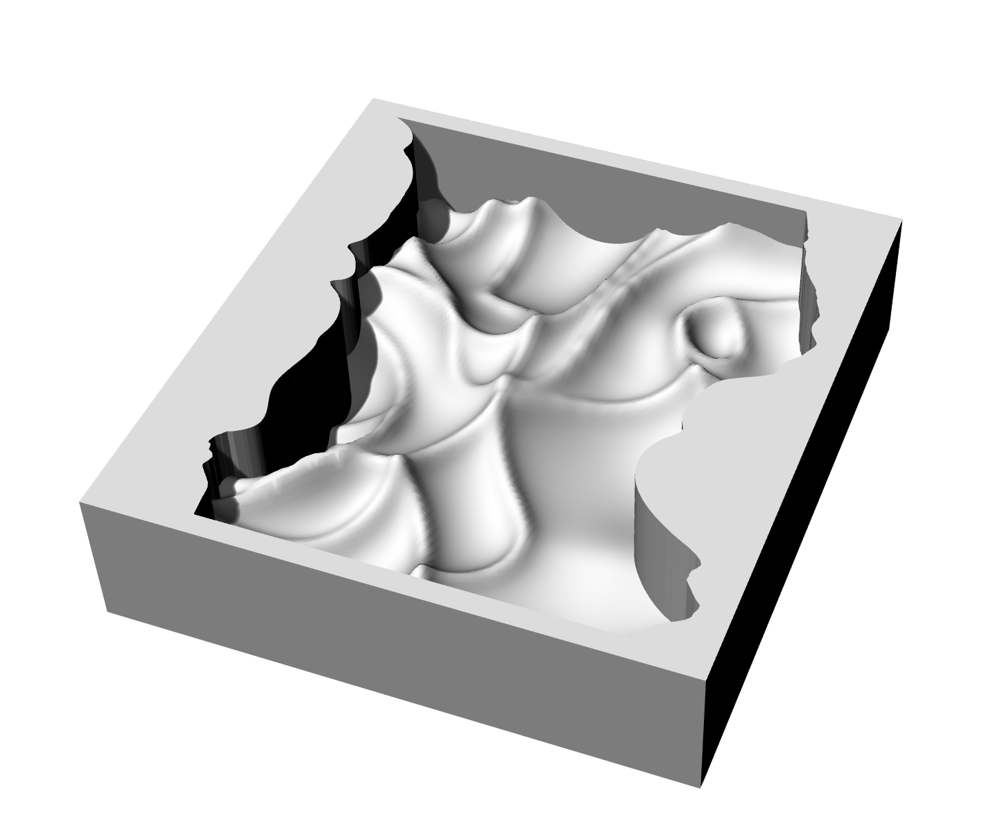
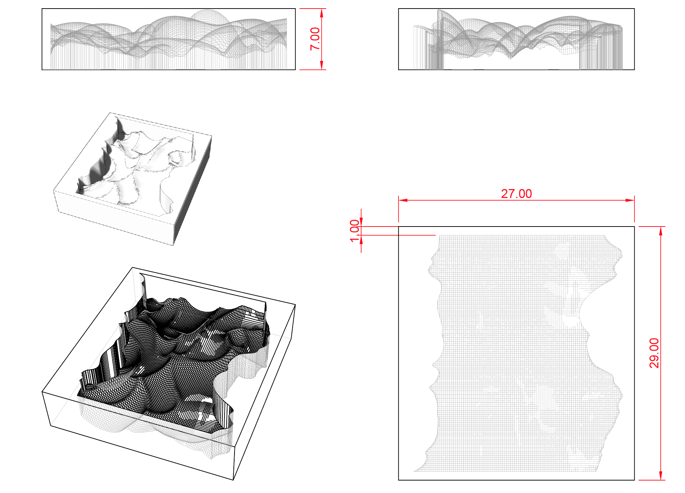
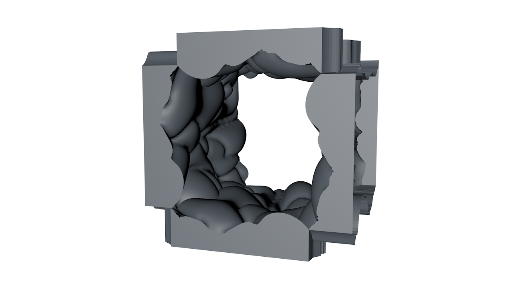
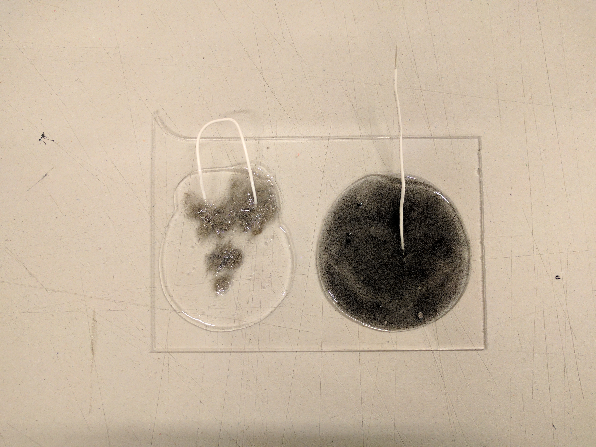
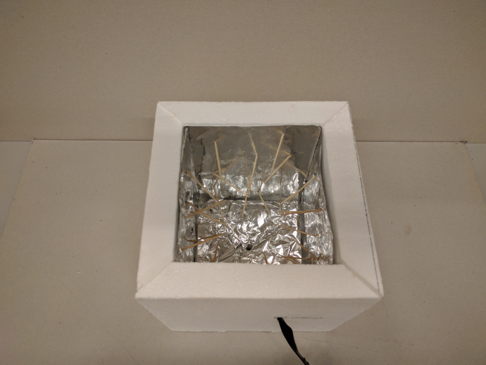
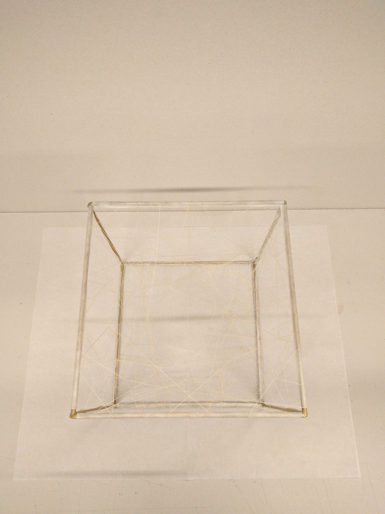
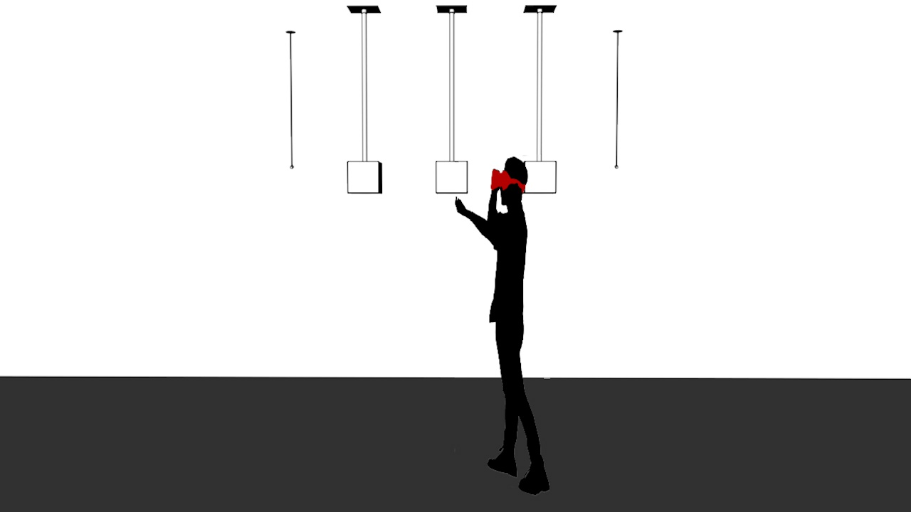
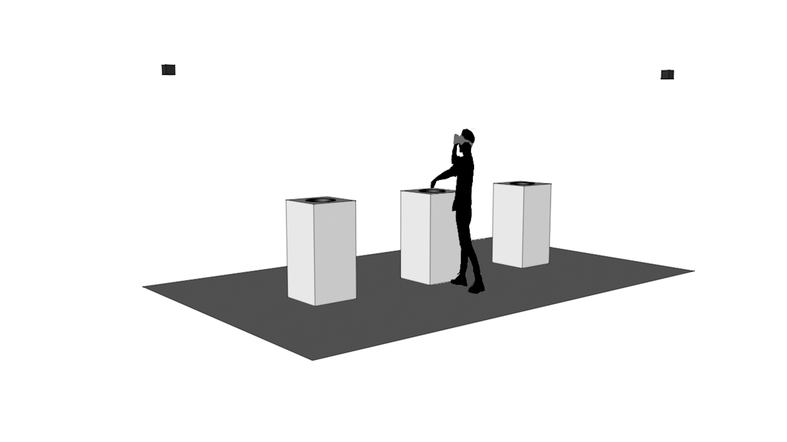

# Diploma project
This project is an attempt to create and establish a strong link between reality and Virtual Reality. In a way that reflect how to manipulate the reality and influence the virtual world and vice versa.

## Moodboard


## TODO | DONE
### Unity
- [ ] Create 3 difference environment for each box.
- [x] Make the animation of the explosion.
- [ ] ~~Every time the user approach one cube a new environment is loaded.~~
- [x] ~~Attach the player to the VR camera.~~
- [x] When the user put his hand inside a cube the world is revealed
	- [x] Clippin Plane
	- [ ] Improve it by adding some light animation
- [x] Improve the scripts for the serial communication between Unity and Arduino.
- [ ] A lot of more stuff in the codes

#### Some visuals
- [ ] Create a storyboard for my virtual universe


### Arduino
- [ ] Calibrate the 3D capacitive sensing controller, here the [values](https://docs.google.com/spreadsheets/d/1_88lRJ6wW6rSmD63nVG9YeYhz5aiGTSd5Py3lijk0ns/edit#gid=2112700507) I get. 
- [x] [VL6180X](https://www.adafruit.com/product/3316) Time of Flight distance sensor prototyped, [Video](http://stellaspeziali.ch/diploma_project_doc/Time_of_Flight%20distance_sensor.mp4) of the test.
- [x] Photocells and optic fibre [I Need to document this].
- [x] FlexSensors.
- [ ] Haptic motor.
- [x] Conductive wire.
- [x] Silicone with conductive fibers from conductive wire.
- [ ] Put everything together.

#### 1. Bubble
- [x] Create a 3D model



- [x] CNC fabrication

- [x] Mix conductive fibers and conductive ink with the silicone

- [ ] Silicone mold x4
- [ ] Fill the mold with:
	- [ ] [Slime](https://www.instagram.com/explore/tags/slime/?hl=it) or
	- [ ] [Pearl clay](https://s-media-cache-ak0.pinimg.com/originals/c7/f3/d3/c7f3d376586a34ae77c89879f5f09bfa.jpg) or
	- [ ] other materials.

#### 2. Pics

- [ ] Create a better prototype using other elements like:
- [ ] brush hairs
- [ ] paper
- [ ] tissue
- [ ] neoprene
- [ ] others

#### 3. Wires

- [x] Create a metallic cube
- [x] Put some normal wires
- [x] Put some conductive wire
- [ ] ~~Make the lines move with:
	- [ ] Shape-memory alloy or
	- [ ] Mini vibrating motors.~~

#### Setup draf
- Boxes attached to the celing

- Boxes on the floor with a support
- Boxes


## Planning manufacturing steps

- [x] 3x plexi boxes
- [ ] build the finals object/s for the diploma that mean cuts, assembly and painting. [I'm still don't have any idea of the final form.]
- [ ] build the support for the Oculus sensors


### Materials to buy
- [x] Glue
- [ ] [Jelly pearls](http://lqp-p-imgs.s3-ap-south-1.amazonaws.com/faceview/jh/ea/b5i/affimgs/az-large-184097.jpg)
- [x] Silicone
- [ ] 3x black plexiglass boxes 1000x350x350mm with a hole of Ø 140mm on the top
- [ ] 2x support for the Oculus sensors
	- [ ] 2x aluminum pole of Ø 8mm
	- [ ] 2x aluminum plates of Ø 110mm
	- [ ] 2x female tripod screw
- [ ] Electronic wire

## Setup spot propositions
On the CV openspace or on the AV expositions space but will depend on the setup.

### Materials to rent
- [ ] Beamer

## Git from Terminal
- Status
```
git status
```

- add all the files
```
git add .
```

- Commit
```
git commit -m "message string"
```

- Push uploader
```
git push
```

- Clone locally
```
git clone git@github.com:spezialis/DiplomaProject.git
```

- Recuperer ficher
```
git pull
```

- Following steps:
pull -> add -> commit -> push

## Credits
By [Stella Speziali](https://stellaspeziali.myportfolio.com/)<br>
Diploma project<br>
Lead by Alain Bellet, Gaël Hugo, Cyril Diagne, Christophe Guignard<br>
Assisted by Tibor Udvari, David Roulin<br>
ECAL/Bachelor Media & Interaction Design<br>
University of Art & Design, Lausanne 2017<br>
[www.ecal.ch](www.ecal.ch)
