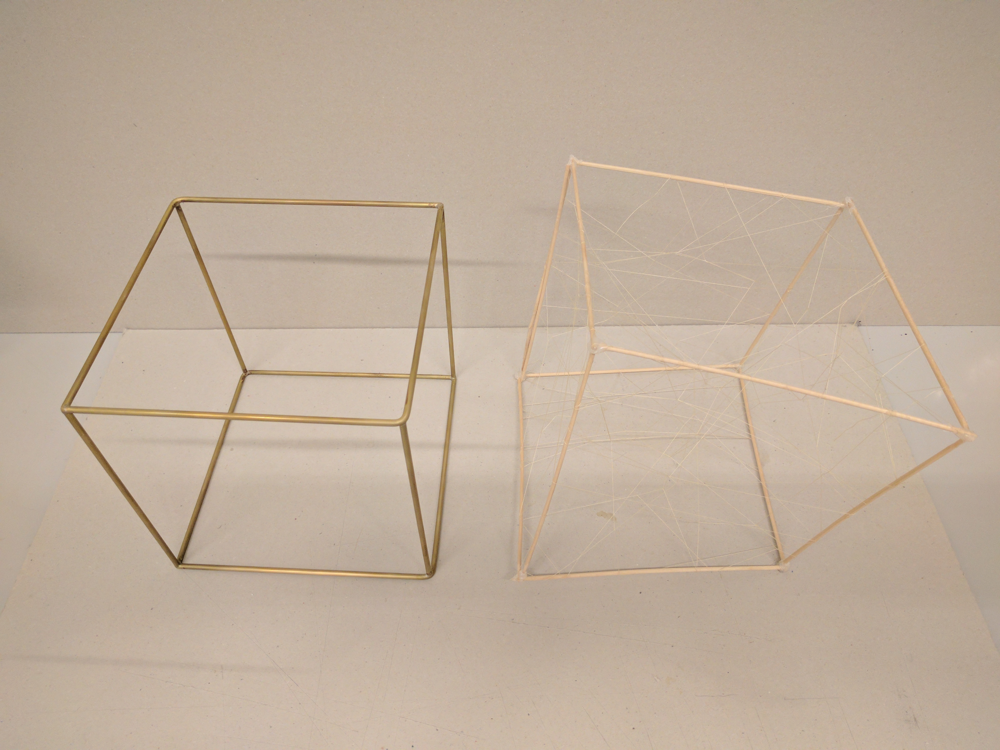

# Diploma project
This project is an attempt to create and establish a strong link between reality and Virtual Reality. In a way the project reflect how to manipulate the reality and influence the virtual world and vice versa. I'm trying to explore what it means to touch some strange materials without seeing our hands and see something happening in a virtual world.

## Moodboard


## TODO | DONE
### Unity
- [ ] Create 3 difference environment for each box.
- [x] Animation of the explosion of the world.
- [x] When the user put his hand inside a cube the world is revealed
- [x] Improve the scripts for the serial communication between Unity and Arduino.

#### Some visuals


### Arduino sensors
- [ ] Arduino mega.
- [x] 4 Capacitive wire + 4 10kΩ resistors + 4 270kΩ resistors.
- [x] 4 Photocells and optic fibre + 4 10kΩ resistors.
- [ ] 1 LED stripe.
- [x] 4 Flex sensors + 4 47kΩ resistors.
- [ ] 3 Distance sensors Sharp GP2Y0A21YK0F 5 V/DC (10-80cm).
- [ ] Put everything together.


#### 1. Bubble
**Materials:**
- [x] Mold

- [ ] 4 Silicone mold with 4 flex sensors.
- [ ] Fill the mold with:
	- [ ] [Pearl clay](https://s-media-cache-ak0.pinimg.com/originals/c7/f3/d3/c7f3d376586a34ae77c89879f5f09bfa.jpg) or
	- [ ] Sagex pearls.
- [ ] Mold support MDF

- [ ] Base MDF
	- [ ] Make a hole for the cables
	- [ ] 4 MDF pieces to connect the mold support and the base


**Virtual Universe:**


**Sensors:**
- [ ] 1 Arduino mega
- [ ] 4 Flex
- [ ] 4 47kΩ resistors
- [ ] Wires from the other boxes

#### 2. Pics
**Materials:**
- [ ] Brush hairs
- [ ] Brush hairs support MDF

- [ ] Base MDF
	- [ ] Make a hole for the cables


**Virtual Universe:**


**Sensors:**
- [ ] 4 Photocells
- [ ] 4 10kΩ resistors
- [ ] LED

#### 3. Wires
**Materials:**
- [ ] Wire support Steel

- [ ] Put some elastic wire
- [ ] Put some conductive wire
- [ ] Base MDF


**Virtual Universe:**


**Sensors:**
- [ ] 4 Capacitive wire
- [ ] 4 10kΩ resistors
- [ ] 4 270kΩ resistors

## Manufacturing planning
- [ ] 3 plexiglass boxes.

- [ ] Build the support for the Oculus sensors.

- [ ] 3 Tubes with base and holes for cables.

### Materials to buy
...

### Materials to rent
- [ ] Beamer.

## Setup
The 3 boxes will be over a special support.


### Setup spot propositions
On the CV openspace or on the AV expositions space but will depend on the setup.

## Git from Terminal
- Status
```
git status
```

- add all the files
```
git add .
```

- Commit
```
git commit -m "message string"
```

- Push uploader
```
git push
```

- Clone locally
```
git clone git@github.com:spezialis/DiplomaProject.git
```

- Recuperer ficher
```
git pull
```

- Following steps:
pull -> add -> commit -> push

## Credits
By [Stella Speziali](https://stellaspeziali.myportfolio.com/)<br>
Diploma project<br>
Lead by Alain Bellet, Gaël Hugo, Cyril Diagne, Christophe Guignard<br>
Assisted by Tibor Udvari, David Roulin<br>
ECAL/Bachelor Media & Interaction Design<br>
University of Art & Design, Lausanne 2017<br>
[www.ecal.ch](www.ecal.ch)
